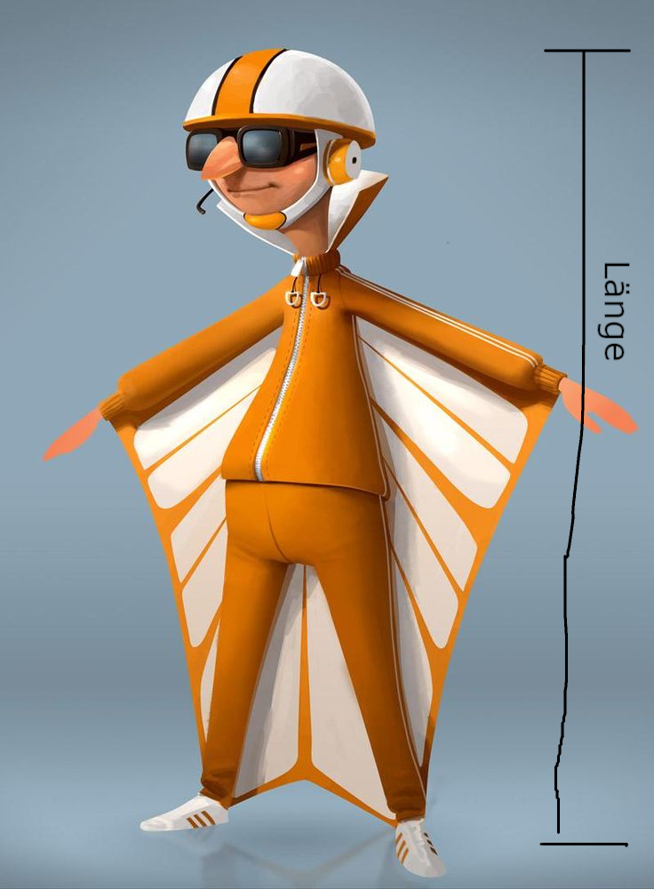

# Kerncurriculum

- Raumanschauung und Koordinatisierung
  - Punkte und Vektoren in Ebene und Raum durch Tupel beschreiben
  - die bildliche Darstellung und Koordinatisierung zur Beschreibung von Punkten, Strecken, ebenen Flächen und einfachen Körpern nutzen
  - Addition, Subtraktion und skalare Multiplikation von Vektoren anwenden und geometrisch veranschaulichen
  - Kollinearität zweier Vektoren überprüfen
- Darstellungsformen
  - Geraden- und Ebenengleichungen in Parameterform verwenden
  - Ebenengleichungen in Normalen- und Koordinatenform verwenden
  - zwischen den Darstellungsformen wechseln
- Maße und Lagen
  - Abstände zwischen Punkten, Geraden und Ebenen bestimmen
  - Skalarprodukt geometrisch als Ergebnis einer Projektion deuten und verwenden
  - Orthogonalität zweier Vektoren überprüfen
  - Winkelgrößen bestimmen
  - Lagebeziehungen von Geraden, Geraden und Ebenen sowie von Ebenen untersuchen und Schnittprobleme lösen
  - den Gauß-Algorithmus zur Lösung linearer Gleichungssysteme erläutern und in geeigneten Fällen anwenden

---

### Kerncurriculum für das Gymnasium

S. 51

https://cuvo.nibis.de/cuvo.php?p=download&upload=208

# Raumanschauung und Koordinatisierung

## Punkte und Vektoren in Ebene und Raum durch Tupel beschreiben

::: columns

:::: column

- Ein Punkt (z.B.: $P(x_1|x_2|x_3)$)  
- Ein Vektor (z.B.: $\vec{v}=\begin{pmatrix}x_1\\x_2\end{pmatrix}$)

::::

:::: column

\begin{center}
\begin{tikzpicture}
    \definecolor{darkgreen}{rgb}{0.0, 0.5, 0.0}
    % Achsen
    \draw[->] (-0.5, 0) -- (5, 0) node[below] {\(x\)};
    \draw[->] (0, -0.5) -- (0, 5) node[left] {\(y\)};
    
    % Vektoren
    \draw[->, thick, blue] (0, 0) -- (3, 1) node[midway, above, sloped] {\(\vec{u}=\begin{pmatrix}3\\1\end{pmatrix}\)};
    
    % Punkte
    \node at (1, 3) [circle, fill, inner sep=1.5pt] {};
    \node[below right] at (1, 3) {\(P(3 | 1)\)};
\end{tikzpicture}
\end{center}

::::

:::

## die bildliche Darstellung und Koordinatisierung zur Beschreibung von Punkten, Strecken, ebenen Flächen und einfachen Körpern nutzen

- Ortsvektor: $\vec{OP}$
- Verbindungsvektor: $\vec{AB}=\begin{pmatrix}a_1-b_1\\a_2-b_2\end{pmatrix}$
- Strecke eines Vektor: $|\vec{AB}|$
- Geaden: $g: \vec{x}=\vec{a}+r\cdot \vec{u}$
- Ebenen: $E: \vec{x}=\vec{a}+r\cdot \vec{u} + s \cdot \vec{v}$

### 

Bin mir nicht ganz sicher was genau hier hin soll

## Addition, Subtraktion und skalare Multiplikation von Vektoren

| Operation               | Definition                              | Beispiel (2D)                               |
|-------------------------|-----------------------------------------|---------------------------------------------|
| **Addition**            | $\overrightarrow{u} + \overrightarrow{v} = \begin{pmatrix} u_1 + v_1 \\ u_2 + v_2 \end{pmatrix}$ | $\begin{pmatrix} 1 \\ 2 \end{pmatrix} + \begin{pmatrix} 3 \\ 4 \end{pmatrix} = \begin{pmatrix} 4 \\ 6 \end{pmatrix}$ |
| **Subtraktion**         | $\overrightarrow{u} - \overrightarrow{v} = \begin{pmatrix} u_1 - v_1 \\ u_2 - v_2 \end{pmatrix}$ | $\begin{pmatrix} 5 \\ 7 \end{pmatrix} - \begin{pmatrix} 2 \\ 3 \end{pmatrix} = \begin{pmatrix} 3 \\ 4 \end{pmatrix}$ |
| **Skalare Multiplikation** | $c \cdot \overrightarrow{u} = \begin{pmatrix} c \cdot u_1 \\ c \cdot u_2 \end{pmatrix}$           | $2 \cdot \begin{pmatrix} 3 \\ 4 \end{pmatrix} = \begin{pmatrix} 6 \\ 8 \end{pmatrix}$      |

---

### Addition

\begin{center}
\begin{tikzpicture}
    \definecolor{darkgreen}{rgb}{0.0, 0.5, 0.0}
    % Achsen
    \draw[->] (-0.5, 0) -- (4.5, 0) node[below] {\(x\)};
    \draw[->] (0, -0.5) -- (0, 4.5) node[left] {\(y\)};
    
    % Vektoren
    \draw[->, thick, blue] (0, 0) -- (3, 1) node[midway, above, sloped] {\(\vec{u}\)};
    \draw[->, thick, red] (3, 1) -- (4, 4) node[midway, above, sloped] {\(\vec{v}\)};
    \draw[->, thick, darkgreen] (0, 0) -- (4, 4) node[midway, below, sloped] {\(\vec{u} + \vec{v}\)};
    
    % Punkte
    % \node at (3, 1) [circle, fill, inner sep=1.5pt] {};
    % \node[below right] at (3, 1) {\((3, 1)\)};
    % \node at (4, 4) [circle, fill, inner sep=1.5pt] {};
    % \node[below right] at (4, 4) {\((4, 4)\)};
\end{tikzpicture}
\end{center}

---

### Subtraktion

\begin{center}
\begin{tikzpicture}
    % Benutzerdefinierte Farben definieren
    \definecolor{darkgreen}{rgb}{0.0, 0.5, 0.0} % Dunkelgrün

    % Achsen
    \draw[->] (-1, 0) -- (3.5, 0) node[below] {\(x\)};
    \draw[->] (0, -2) -- (0, 3.5) node[left] {\(y\)};
    
    % Vektoren
    \draw[->, thick, blue] (0, 0) -- (3, 1) node[midway, above, sloped] {\(\vec{u}\)};
    \draw[->, thick, red] (0, 0) -- (1, 3) node[midway, below, sloped] {\(\vec{v}\)};
    \draw[->, thick, orange] (3, 1) -- (2, -2) node[midway, above, sloped] {\(-\vec{v}\)};
    \draw[->, thick, orange] (0, 0) -- (-1, -3) node[midway, above, sloped] {\(-\vec{v}\)};
    \draw[->, thick, darkgreen] (0, 0) -- (2, -2) node[midway, below, sloped] {\(\vec{u} - \vec{v}\)};
    
\end{tikzpicture}
\end{center}

---

### Skalare Multiplikation

\begin{center}
\begin{tikzpicture}
    \definecolor{darkgreen}{rgb}{0.0, 0.5, 0.0}
    % Achsen
    \draw[->] (-1, 0) -- (5, 0) node[below] {\(x\)};
    \draw[->] (0, -1) -- (0, 2) node[left] {\(y\)};
    
    % Skalierte Vektoren
    \draw[->, thick, darkgreen] (0, 0) -- (4.5, 1.5) node[midway, below, sloped] {\(1.5 \cdot \vec{u}\)};
    \draw[->, thick, red] (0, 0) -- (-1.5, -0.5) node[midway, above, sloped] {\(-0.5 \cdot \vec{u}\)};

    % Original-Vektor
    \draw[->, thick, blue] (0, 0) -- (3, 1) node[midway, above, sloped] {\(\vec{u}\)};
\end{tikzpicture}
\end{center}

## Kollinearität zweier Vektoren überprüfen

::: columns

:::: column

- Ein Vektor ist ein vielfaches eines anderen.
- In einfach: Beide "zeigen" in die selbe Richtung

$$
\vec{a}\cdot x = \vec{b} \quad ; \quad \vec{a}\cdot x \neq \vec{c}
$$

\onslide<2> $\vec{a}$ und $\vec{b}$ sind kollinear, $\vec{a}$ und $\vec{b}$ zu $\vec{c}$ aber nicht.

::::

:::: column

\begin{center}
\begin{tikzpicture}
    \definecolor{darkgreen}{rgb}{0.0, 0.5, 0.0}
    % Achsen
    \draw[->] (-1, 0) -- (5, 0) node[below] {\(x\)};
    \draw[->] (0, -1) -- (0, 2) node[left] {\(y\)};
    
    % Skalierte Vektoren
    \draw[->, thick, darkgreen] (0, 0) -- (4.5, 1.5) node[midway, below, sloped] {\(1.5 \cdot \vec{u}\)};
    \draw[->, thick, red] (0, 0) -- (-1.5, -0.5) node[midway, above, sloped] {\(-0.5 \cdot \vec{u}\)};

    % Original-Vektor
    \draw[->, thick, blue] (0, 0) -- (3, 1) node[midway, above, sloped] {\(\vec{u}\)};
\end{tikzpicture}
\end{center}

::::

:::

# Darstellungsformen

## Geradengleichungen

- Parameterform: $g: \vec{x}=\vec{a}+r\cdot \vec{u}$
- Koordinatenform: $g: a\cdot \vec{x_1}+b\cdot \vec{x_2}=c$

---

### Parameterform:

\begin{center}
\begin{tikzpicture}
    \definecolor{darkgreen}{rgb}{0.0, 0.5, 0.0}
    % Achsen
    \draw[->] (-1, 0) -- (6, 0) node[below] {\(x\)};
    \draw[->] (0, -1) -- (0, 5) node[left] {\(y\)};
    
    % Gerade
    \draw[thick, red] (-1, 4) -- (5, 1) node[above right] {\(\vec{g}\)};

    % Richtungsvektor u
    \draw[->, thick, darkgreen] (1, 3) -- (3, 2) node[midway, above, sloped] {\(r \cdot \vec{u} = r \cdot \begin{pmatrix} 2 \\ -1 \end{pmatrix}\)};

    % Ortsvektor a
    \draw[->, thick, blue] (0, 0) -- (1, 3) node[midway, above, sloped] {\(\vec{a} = \begin{pmatrix} 1 \\ 3 \end{pmatrix}\)};
    
    
\end{tikzpicture}
\end{center}

## Ebenengleichungen

- Parameterform: $E: \vec{x}=\vec{a}+r\cdot \vec{u} + s \cdot \vec{v}$
    - $\vec{u}$ und $\vec{v}$ sind sog. Spannvektoren, sie spannen die Ebene auf
    - $\vec{a}$ ist der Stützvektor der Ebene
- Koordinatenform: $E: a\cdot \vec{x_1}+b\cdot \vec{x_2} + c \cdot \vec{x_3} = d$
- Normalenform: $E: \vec{n} \cdot (\vec{x}-\vec{p}) = 0$
    - $\vec{x}$: Stützvektor
    - $\vec{n}$: Normalenvektor
    - $\vec{p}$: ein fester Punkt auf der Ebene

---

### Parameterform 

\begin{center}
\begin{tikzpicture}
    \definecolor{darkgreen}{rgb}{0.0, 0.5, 0.0}
    \definecolor{darkblue}{rgb}{0.0, 0.0, 0.5}

    % Achsen
    \draw[->] (-1, 0, 0) -- (5, 0, 0) node[below right] {\(x\)};
    \draw[->] (0, -1, 0) -- (0, 5, 0) node[below left] {\(y\)};
    \draw[->] (0, 0, -1) -- (0, 0, 5) node[above] {\(z\)};
    
    % Ebene
    \fill[red, opacity=0.3] (1, 1, 1) -- (4, 2, 1) -- (3, 4, 1) -- (0, 3, 1) -- cycle;
    % \node at (2.5, 2.5, 1.5) {\(\vec{E}(s, t)\)};
    
    % Stützvektor
    \draw[->, thick, blue] (0, 0, 0) -- (1, 1, 1) node[midway, above, sloped] {\(\vec{p} = \begin{pmatrix} 1 \\ 1 \\ 1 \end{pmatrix}\)};
    
    % Richtungsvektoren
    \draw[->, thick, darkgreen] (1, 1, 1) -- (4, 2, 1) node[midway, below, sloped] {\(s \cdot \vec{u} = s \cdot \begin{pmatrix} 3 \\ 1 \\ 0 \end{pmatrix}\)};
    \draw[->, thick, darkblue] (1, 1, 1) -- (3, 4, 1) node[midway, above, sloped] {\(t \cdot \vec{v} = t \cdot \begin{pmatrix} 2 \\ 3 \\ 0 \end{pmatrix}\)};
\end{tikzpicture}
\end{center}

---

### Normalenform

\begin{center}
\begin{tikzpicture}
    \definecolor{darkgreen}{rgb}{0.0, 0.5, 0.0}
    \definecolor{darkblue}{rgb}{0.0, 0.0, 0.5}

    % Achsen
    \draw[->] (-1, 0, 0) -- (4, 0, 0) node[below right] {\(x\)};
    \draw[->] (0, -1, 0) -- (0, 4, 0) node[below left] {\(y\)};
    \draw[->] (0, 0, -1) -- (0, 0, 4) node[above] {\(z\)};
    
    % Ebene
    \fill[red, opacity=0.3] (1, 1, 1) -- (4, 2, 1) -- (3, 4, 1) -- (0, 3, 1) -- cycle;
    % \node at (2.5, 2.5, 1.5) {\(\vec{E}\)};
    
    % Stützvektor
    \draw[->, thick, blue] (0, 0, 0) -- (1, 1, 1) node[midway, above, sloped] {\(\vec{p} = \begin{pmatrix} 1 \\ 1 \\ 1 \end{pmatrix}\)};
    
    % Normalenvektor
    \draw[->, thick, darkgreen] (1, 1, 1) -- (3, 0, 4) node[midway, right] {\(\vec{n} = \begin{pmatrix} 2 \\ -1 \\ 3 \end{pmatrix}\)};
    
    % Punkt auf der Ebene
    \draw[fill] (1, 1, 1) circle [radius=0.05];
    \node[below right] at (1, 1, 1) {\(\vec{p}\)};
\end{tikzpicture}
\end{center}

## zwischen den Darstellungsformen wechseln

::: columns

:::: column

### Ebene: Parameterform -> Koordinatenform

$$
E: \vec{x}=\vec{a} + s \cdot \vec{v}+r \cdot \vec{v}
\begin{aligned}
\vec{n}&=\vec{u}\times \vec{v}&&\\
\Rightarrow \vec{n}&=
\begin{pmatrix}
a \\
b \\
c
\end{pmatrix}
\end{aligned}
$$

nun $\vec{a}$ als Stützvektor einsetzen und $d$ berechnen:

$$
E: a\cdot \vec{x_1}+b\cdot \vec{x_2} + c \cdot \vec{x_3} = d
$$

::::

:::: column

### Kreuzprodukt:

$$
\vec{a} \times \vec{b} = \begin{pmatrix}
a_2 \cdot b_3 - a_3 \cdot b_2 \\
a_3 \cdot b_1 - a_1 \cdot b_3 \\
a_1 \cdot b_2 - a_2 \cdot b_1
\end{pmatrix}
$$

::::

:::

---

::: columns

:::: column

### Ebene: Parameterform <- Koordinatenform

1. Drei verschiedene Punkte auf der Ebene finden
2. Mit diesen die Ebene aufspannen.
    1. $\vec{a}$ ist ein Stützvektor eines beliebiegen Punktes
    2. $\vec{u}$ und $\vec{v}$ sind Vektoren, welche von $\vec{a}$ aus auf einen Punkt in der Ebene zeigen. Sie dürfen nicht Kollinear sein, da sie die Ebene aufspannen müssen.

::::

:::: column

### Skalarprodukt

$$
\begin{aligned}
\vec{a} \cdot \vec{b} &= 
\begin{pmatrix}
a_1 \\ a_2 \\ a_3
\end{pmatrix}
\cdot
\begin{pmatrix}
b_1 \\ b_2 \\ b_3
\end{pmatrix} &&\\
&= 
a_1 \cdot b_1 +
a_2 \cdot b_2 +
a_3 \cdot b_3
\end{aligned}
$$

::::

:::

---

### Ebene: Normalenform -> Koordinatenform

$$
\begin{aligned}
&E: (\vec{x}-\vec{p}) \cdot \vec{n}&=0&&\\
\Rightarrow \quad & n_1 \cdot (x_1 - p_1) + n_2 \cdot (x_2 - p_2) + n_3 \cdot (x_3-p_3) & = 0 &&\\
\Rightarrow \quad & n_1x_1-n_1p_1 + n_2x_2 -n_2p_2 + n_3x_3-n_3p_3 & = 0 &&\\
\Rightarrow \quad & n_1x_1+n_2x_2+n_3x_3=n_1p_1+n_2p_2+n_3p_3 & &&\\
\Rightarrow \quad & n_1x_1+n_2x_2+n_3x_3= d = n_1p_1+n_2p_2+n_3p_3 & &&
\end{aligned}
$$

### Einfach gesagt:

$$
\vec{n}=\begin{pmatrix}a\\b\\c\end{pmatrix} \quad \text{und} \quad \vec{n}\cdot \vec{p}=d
$$

$$
E: a\cdot x_1 + b \cdot x_2 + c \cdot x_3 = d
$$

#   Maße und Lagen

## Abstände zwischen Punkten, Geraden und Ebenen bestimmen

### Zwischen zwei Punkten

$Q(q_1|q_2|q_3)$ und $P(p_1|p_2|p_3)$:

$$
A=\sqrt{(p_1 - q_1)^2 + (p_2 - q_2)^2 + (p_3 - q_3)^2}
$$

---

### Zwischen einem Punkt $R$ und einer Ebene $E$

1. Gerade $g: \vec{x}=\vec{OR}+t\cdot \vec{n}$
2. Schnittpunkt $S$ von $g$ und $E$ berechnen.
3. Länge von $\vec{SR}$ berechnen.

### Schnittpunkt

Beide zu untersuchenden Geraden, bzw Ebenen, gleichsetzen.

--- 

### Punkt $R$ zu einer Gerade $g$:

1. Hilfebene $E$ mit dem Richtungsvektor $\vec{r}$ von $g$ als $\vec{n}$ aufstellen

$$
E: r_1x_1 + r_2x_2 + r_3x_3 = k
$$

2. Schnittpunkt $S$ bestimmen
3. Länge von $\vec{SR}$ berechnen

---

### Länge von Vektor berechnen

::: columns

:::: column

$$
|\vec{v}|=\sqrt{x_1^2 + x_2^2 + x_3^2}
$$

::::

:::: column

{ height=500px }

::::

:::

---

### Skalarprodukt

$$
\vec{a}\cdot \vec{b}=a_1\cdot b_1 + a_2\cdot b_2 + a_3\cdot b_3
$$

### Orthogonalität

Wenn das Skalarprodukt $=0$, dann sind $\vec{a} \perp \vec{b}$, $\vec{a}$ und $\vec{b}$ orthogonal.

### Winkelgröße

$$
\cos{\alpha}=\frac{\vec{a}\cdot \vec{b}}{|\vec{a}| \cdot |\vec{b}|}
$$

- Für Vektoren, die in dieselbe Richtung zeigen, gilt: $\alpha = 0^\circ$
- Für Vektoren, die in entgegengesetze Richtung zeigen, gilt: $\alpha = 180^\circ$

## Lagebeziehungen:

### Geraden können:

- sich schneiden, wenn ihre Richtungsvektoren linear unabhhängig sind und $g: x = h: x$.
- windschief zueinander sein, wenn ihre Richtungsvektoren linear unabhhängig sind und $g:x \neq h:x$.
- parallel und verschieden sein, wenn ihre Richtungsvekoren kollinear sind und der Punkt $P$ von $g$ nicht auf $h$ liegt.
- parallel und identisch sein, wenn ihre Richtungsvekoren kollinear sind und der Punkt $P$ von $g$ auf $h$ liegt.

---

### Geraden und Ebenen können:

- sich Schneiden, wenn $\vec{n} \cdot \vec{g} = 0$.
- Parallel zueinander sein und haben keinen gemeinsamen Punkt, wenn $\vec{n} \cdot \vec{g} = 0 \quad P \notin E$.
- Parallel zueinander sein und haben unendlich viele gemeinsame Punkte, wenn $\vec{n} \cdot \vec{g} = 0 \quad P \in E$.

---

### Ebenen können:

- sich entlang einer Schnittgeraden schneiden, wenn $\vec{n_1}$ und $\vec{n_2}$ linear unabhängig sind.
- parallel zueinander sein, wenn $\vec{n_1}$ und $\vec{n_2}$ kollinear sind und $P \notin E$.
- identisch und parallen zueinander sein, wenn n und n kollinear sind und $P \in E$.
